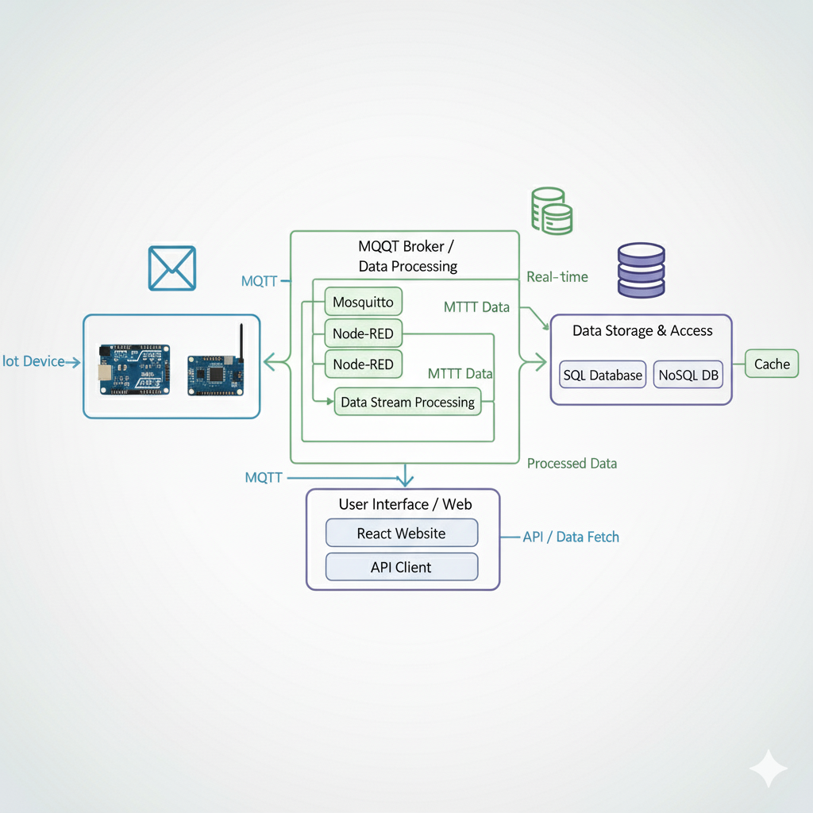
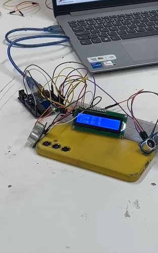
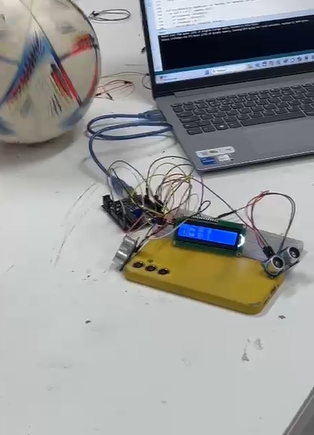

# ⚽ Passa Pra Ela: Placar IoT em Tempo Real 🏆  

Bem-vindo ao repositório do **Passa Pra Ela**, um sistema inteligente que conecta dispositivos IoT para monitorar em tempo real o placar de jogos de futebol feminino amador, trazendo mais visibilidade, organização e inovação para o esporte!  

---

## 📝 Descrição Completa do Problema  

O futebol feminino ainda enfrenta grandes desafios em termos de **visibilidade e estrutura**. Hoje:  
- Placar e estatísticas são registrados de forma manual ou informal.  
- Não há padronização nem integração de dados em tempo real.  
- Dificuldade em armazenar e analisar histórico de jogos.  
- Pouco acesso a plataformas digitais para acompanhar as partidas.  

Nosso sistema resolve isso com uma solução **IoT + Cloud + Web**, automatizando a coleta e exibição de dados em tempo real.  

---

## ✨ Visão Geral do Projeto (IoT para Monitoramento de Placar)  

Este projeto usa **Arduino/ESP32** para representar dispositivos que registram os gols dos times. Os dados são enviados via **MQTT (Mosquitto)**, processados pelo **Node-RED** e armazenados em um banco de dados, podendo ser consumidos por uma aplicação **React**.  

📌 Fluxo:  
**IoT Device → Mosquitto (Broker MQTT) → Node-RED → SQL Database → API → React Website**  



---

## 🛠️ Componentes Utilizados (Hardware e Software Essenciais)  

### 🔩 Hardware (IoT Device)  
- **ESP32 / Arduino Uno**: Dispositivo de entrada de eventos (ex: botão de gol).  
- **Botões físicos**: Simulam gols de cada time.  
- **Display OLED/LCD** (opcional): Mostra o placar localmente.  

### 💻 Software  
- **Mosquitto (Broker MQTT)**: Responsável pelo transporte das mensagens.  
- **Node-RED**: Orquestra os fluxos de dados e gera dashboards.  
- **SQL Database**: Armazena os resultados para análises posteriores.  
- **React Website**: Interface web para visualização em tempo real.  

---

## ⚙️ Funcionamento do Arduino

- O código do Arduino foi desenvolvido para detectar gols automaticamente e atualizar o placar.

- Sensoriamento de Gols

- Cada time possui um sensor ultrassônico apontado para a área do gol.

- Se a bola passar e a distância medida for menor que 20 cm, o sistema considera um gol válido.

- Há um tempo de espera (10 segundos) entre detecções para evitar contagem duplicada.

- Placar Local

- O display LCD exibe em tempo real os gols de cada time:

Time A: X

Time B: Y


- **Alerta Sonoro**

- Ao marcar gol, o buzzer toca uma melodia exclusiva para cada time:

- Time A → Trecho da música da Liga dos Campeões.

- Time B → Trecho de We Are the Champions.

- **Integração com a Plataforma**

- O Arduino pode enviar os eventos de gol via Serial ou MQTT, permitindo que o Node-RED registre e repasse os dados para o banco de dados e para o site React.

---

## 🧠 Como o Sistema Funciona  

1. **Coleta de Dados**: Arduino envia eventos de gols via MQTT (`placar/timeA`, `placar/timeB`).  
2. **Processamento**: Node-RED recebe e organiza as mensagens.  
3. **Armazenamento**: Node-RED grava os dados em banco de dados SQL.  
4. **Visualização**: Dados são exibidos em dashboard do Node-RED e em site React via API.  

---

## 🛠️ Hadware  






---

## 🚀 Guia Rápido para Simular o Projeto  

### 🖥️ Simulação com Node-RED e Mosquitto  
1. **Instalar o Mosquitto**:  
   - Windows: baixar do site oficial → [https://mosquitto.org/download/](https://mosquitto.org/download/)  
   - Rodar com:  
     ```bash
     mosquitto.exe -v
     ```  

2. **Rodar o Node-RED**:  
    ```bash
    node-red
    ```

## Importar o Flow de Simulação

O arquivo do flow de simulação está disponível em:  
`/nodered/flow.json`

**Como importar no Node-RED**
1. Abra o Node-RED (`http://localhost:1880`).
2. No canto superior direito clique no menu (☰) → **Import** → **File**.
3. Selecione o arquivo `flow.json` (ou cole o JSON no campo **Clipboard**) e clique em **Import**.
4. Faça **Deploy**.

---

## Tópicos do Flow

Este flow contém os seguintes tópicos MQTT:

- `placar/timeA`  
- `placar/timeB`

Dois **inject nodes** permitem simular gols (um para cada time).

---

## Acessar o Dashboard

Depois de importar e dar **Deploy** no Node-RED:

- Abra o dashboard no navegador:  
  `http://localhost:1880/ui`

Você verá os gráficos e widgets atualizando em tempo real conforme os injects publicarem mensagens nos tópicos.

---

## 🌐 Integração com Website React

- O banco de dados (SQL ou NoSQL) armazena os dados recebidos do Node-RED.  
- Uma API (exposta pelo backend) disponibiliza os dados para consumo pela aplicação React.  
- O site em React consome essa API para exibir: placar em tempo real, estatísticas e histórico de jogos.

---

## 🌐 Links Importantes

- **Link para vídeo demonstrativo (YouTube):** `adicione aqui`  
- **Link para simulação no Node-RED:** `adicione aqui`  
- **Link para repositório front-end React:** `adicione aqui`

---

## ⚠️ Observações Cruciais para o Sucesso

- Verifique se o **Mosquitto** (broker MQTT) está rodando antes de iniciar o Node-RED.  
- Portas padrão:
  - **MQTT:** `1883`  
  - **Node-RED (editor):** `1880`  
  - **Node-RED (dashboard):** `http://localhost:1880/ui`
- Ajuste os tópicos MQTT no Arduino e no Node-RED para que sejam os mesmos.  
- Se quiser simular sem hardware, use apenas os **inject nodes** no Node-RED.

---

## 🤝 Equipe: Passa Pra Ela

[<br /><sub>**Gabriel Akira**</sub>](https://github.com/Gakira06)  
**Gabriel Akira Borges** — RM: 565191

[<br /><sub>**Gustavo Santos**</sub>](https://github.com/gugasantos24)  
**Gustavo Francisco Santos** — RM: 561820

[<br /><sub>**Ana Luiza**</sub>](https://github.com/Naluaqui) 
**Ana Luiza Tibiriçá** — RM: 562098

[<br /><sub>**Mauro Carlos**</sub>](https://github.com/Nogrog150)
**Mauro Carlos** — RM: 556645